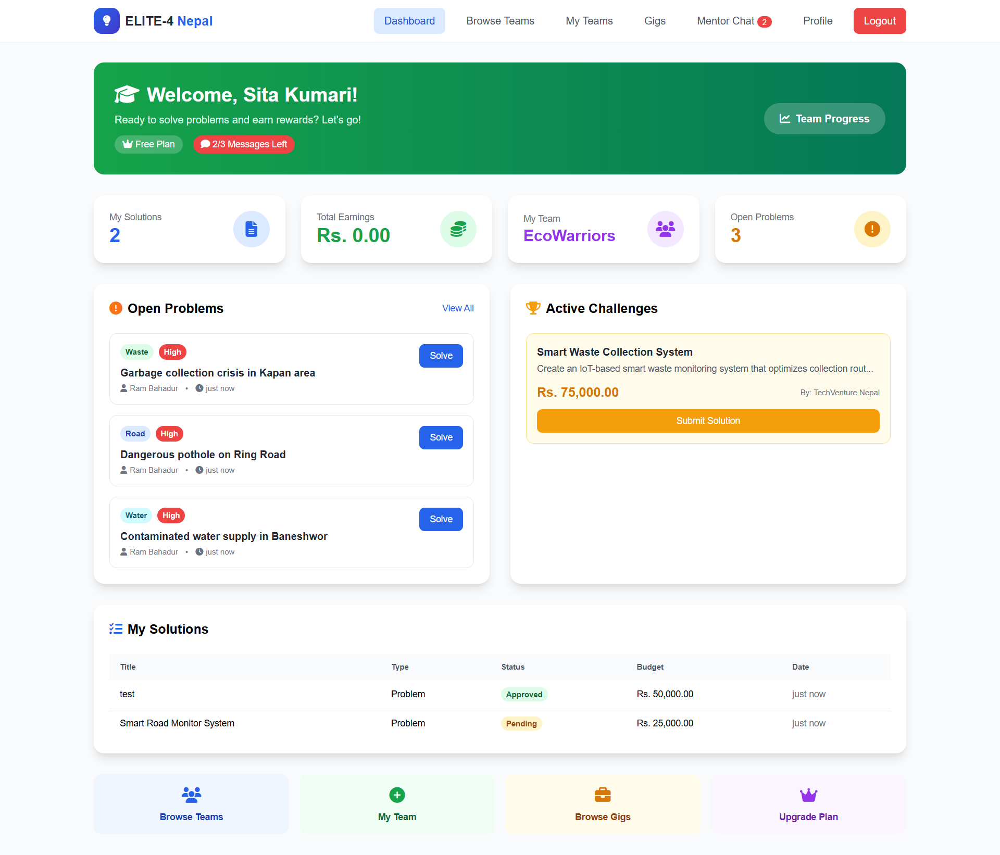

# 🚀 ELITE-4 Nepal "The Problem Solver"

Demo : https://elite4.freedev.app/
---
> **ELITE-4 Nepal** is a multi-stakeholder innovation platform connecting citizens, students, sponsors, and mentors to solve Nepal's real-world problems through gamified governance, trust-based reputation, and SDG-aligned micro-gigs.

---

## ✨ Key Features

| Feature | Description |
|---------|-------------|
| 🤝 **Multi-Role Dashboards** | 5 distinct dashboards: Citizen, Student, Sponsor, Mentor, Admin |
| 🏆 **Trust Score System** | Gamified reputation with 5 tiers (At Risk → Elite) |
| 📊 **Proof of Progress (PoP)** | 14-day mandatory updates with milestone tracking |
| 💰 **Escrow System** | 10-20% startup commitment deposit for challenge integrity |
| 🎯 **11 Governance Rules** | Full Nepal Startup Governance Framework |
| 📱 **Voice Notes** | Record problem descriptions with MediaRecorder API |
| 💬 **Real-Time Chat** | Team messaging with 3-second AJAX polling |
| 🏅 **Gold Badge** | Special recognition for teams with 3+ successful projects |
| 🌏 **SDG Impact** | Local impact categories aligned with Sustainable Development Goals |
| 📈 **Analytics Dashboard** | Sponsor progress tracking with Chart.js visualizations |

---

## ⚡ Quick Start

### Prerequisites

- PHP 7.4 or higher
- MySQL 5.7 or higher
- Apache/Nginx web server (or XAMPP/WAMP/MAMP)

### Installation

```bash
# 1. Clone the repository
git clone https://github.com/yourusername/elite4-nepal.git
cd elite4-nepal

# 2. Create the database
# Open phpMyAdmin and create: elite4_nepal

# 3. Import the database schema
mysql -u root -p elite4_nepal < database.sql

# 4. Create upload directories
mkdir -p uploads/profiles uploads/voice
chmod 755 uploads uploads/profiles uploads/voice

# 5. Configure database connection
# Edit config.php with your credentials (defaults work for localhost)
```

### Access the Application

```
http://localhost/elite4-nepal/
```

---

## 🔐 Demo Accounts

All demo accounts use password: `password123`

| Role | Email | Dashboard |
|------|-------|-----------|
| 👤 Citizen | `citizen@elite4.com` | Report problems, post micro-gigs |
| 🎓 Student | `student@elite4.com` | Join teams, submit solutions |
| 💼 Sponsor | `sponsor@elite4.com` | Fund challenges, track progress |
| 🎓 Mentor | `mentor@elite4.com` | Guide teams, validate progress |
| ⚙️ Admin | `admin@elite4.com` | Platform management, moderation |

---

## 📜 11 Nepal Startup Governance Rules

### Rule 1: Elite Trust Score System
Everyone starts at **100 points**. Earn rewards for positive actions:
- ✅ Milestone completed: **+5 points**
- ✅ Progress update submitted: **+2 points**
- ✅ Upvote received: **+1 point**
- ✅ Escrow released: **+5 points**
- ❌ Late submission: **-10 points**
- ❌ Ghost project (14+ days inactive): **-15 points**
- ❌ Fake problem reported: **-25 points + ban**

**Consequence:** Below 60 points = no access to high-paying gigs (above Rs. 25,000)

### Rule 2: Proof of Progress (PoP)
Teams must submit at least one **Progress Update every 14 days**:
- Accepted types: Code commit links, prototype photos, mentor sign-off, documents
- **Consequence:** Inactive teams are marked, opened for other teams, sponsor alerted, **-10 trust points**

### Rule 3: First-Look Rights
Sponsors with 1+ funded milestone get **48-hour early access** to high-upvoted problems and top-tier teams before public release.

### Rule 4: Dispute Resolution Protocol
- Funds locked in escrow when dispute raised
- Independent platform mentor assigned
- Final decision: Release funds to team OR refund sponsor

### Rule 5: Nepal Startup Verification
Required for challenges above Rs. 25,000:
- Company registration document
- PAN/VAT number
- Founder ID verification
- Escrow agreement acceptance

### Rule 6: Student IP Protection
Every submission gets timestamped record, team ownership, and digital proof. Startups can purchase exclusive IP rights.

### Rule 7: Local Impact Requirement
Projects must contribute to at least one SDG category: Employment, Education, Agriculture, Tourism, Environment, or Digital.

### Rule 8: Startup Commitment Deposit
Before posting paid challenges, deposit **10-20% into escrow**. If sponsor disappears, deposit transfers to affected teams.

### Rule 9: Mentor Validation System
Challenges above Rs. 100,000 require an **approved mentor** (college faculty, industry expert, or certified professional).

### Rule 10: Gold Badge (Talent Pipeline)
After **3+ successful projects**, teams earn Gold Badge with:
- Priority hiring opportunities
- Internship recommendations
- Early talent access for sponsors

### Rule 11: Nepal Compliance & Ethics
**Prohibited:** Fraud, gambling, illegal finance, academic cheating, privacy violation, hate speech, copyright infringement.

---

## 🛠 Tech Stack

| Layer | Technology |
|-------|------------|
| **Backend** | PHP 7.4+ (Vanilla, MySQLi) |
| **Frontend** | Tailwind CSS 3.x (CDN), Font Awesome 6 |
| **Database** | MySQL 5.7+ |
| **Charts** | Chart.js |
| **Real-time** | AJAX polling (3-second intervals) |
| **Audio** | MediaRecorder API (Web Audio) |

---

## 📁 Project Structure

```
elite4-nepal/
├── index.php                    # Landing page with success stories
├── login.php                    # User authentication
├── register.php                 # Multi-step registration
├── dashboard.php                # Role-based dashboard router
├── profile.php                  # Profile & photo management
│
├── PROBLEM/                     # Citizen problem submission
│   ├── post_problem.php         # Post with AI classification + voice
│   ├── problem_detail.php       # View & submit solutions
│   └── submit_solution.php      # Solution submission
│
├── TEAM/                        # Team management
│   ├── team_formation.php       # Create/manage teams
│   ├── team_progress.php        # Milestone tracking
│   ├── team_leaderboard.php     # Team rankings
│   └── chat.php                 # Real-time team chat
│
├── GIGS/                        # Micro-gigs (SDG 8)
│   ├── micro_gigs.php           # Browse gigs
│   ├── post_gig.php             # Post a gig
│   └── my_gigs.php              # Manage applications
│
├── SPONSOR/                     # Sponsor dashboard
│   ├── create_challenge.php     # Create funded challenges
│   ├── sponsor_progress.php     # Analytics with charts
│   └── my_sponsorships.php      # Track funding
│
├── GOVERNANCE/                  # Platform governance
│   ├── governance.php           # Full rules explanation
│   └── progress_update.php      # Submit PoP updates
│
├── ADMIN/                       # Admin tools
│   ├── admin_teams.php          # Team management
│   └── admin_chat_moderation.php # Message moderation
│
├── API/                         # REST API endpoints
│   ├── api_send_message.php     # Send chat message
│   ├── api_get_messages.php     # Get message history
│   └── api_upvote_problem.php   # Upvote with trust points
│
├── database.sql                 # Full schema (23 tables)
├── config.php                   # DB config + governance functions
└── uploads/                     # User uploads
    ├── profiles/                # Profile photos
    └── voice/                   # Voice recordings
```

---

## 📊 Database Schema (23 Tables)

| Table | Purpose |
|-------|---------|
| `users` | All user accounts with trust scores |
| `user_subscriptions` | Plan tracking & message limits |
| `trust_score_logs` | Gamified reputation history |
| `problems` | Citizen-reported issues |
| `challenges` | Sponsor-created contests |
| `solutions` | Team submissions |
| `teams` | Team info with gold badge status |
| `team_milestones` | Progress milestones |
| `progress_updates` | PoP system updates |
| `chat_groups` | Chat group management |
| `chat_messages` | Message history |
| `micro_gigs` | SDG-aligned paid tasks |
| `disputes` | Escrow dispute resolution |
| `startup_verifications` | Sponsor verification |
| `compliance_violations` | Ethics enforcement |

---

## 🎨 Screenshots

> *(Add screenshots of each dashboard here)*

| Landing Page | Student Dashboard | Sponsor Analytics |
|:---:|:---:|:---:|
|  |  |  | ! [admin](screenshots/admin dashboard.png) | ! [mentor](screenshots/mentor dashboard.png) |

---

## 🔧 Troubleshooting

### "Connection failed" error
- Verify MySQL is running
- Check database credentials in `config.php`
- Ensure `elite4_nepal` database exists

### Upload failed error
- Check `uploads/` directory exists
- Verify write permissions: `chmod 755 uploads`
- Check PHP upload limits in `php.ini`

### Voice recording not working
- Use Chrome browser (required for Web Speech API)
- Allow microphone permissions when prompted

### Chat not updating
- Enable JavaScript
- Check browser console for errors
- Verify session is active

---

## 📄 License

This project was built for the **Nepal Hackathon** demonstration purposes.

### Team Member
-Aashish Jha (Full Stack+ BACKEND)
-Rabin Jaishi(Full Stack+ BACKEND)
-Alina Dahal (CSS & FRONTEND)
-Rejina Shrestha(Ui Design & FRONTEND)


**Built with ❤️ for Nepal's community innovation**

---

## 🙏 Acknowledgments

- Nepal's vibrant startup ecosystem
- Sustainable Development Goals (SDGs) framework
- Open source community
